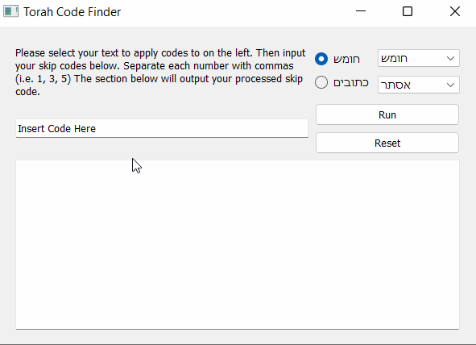
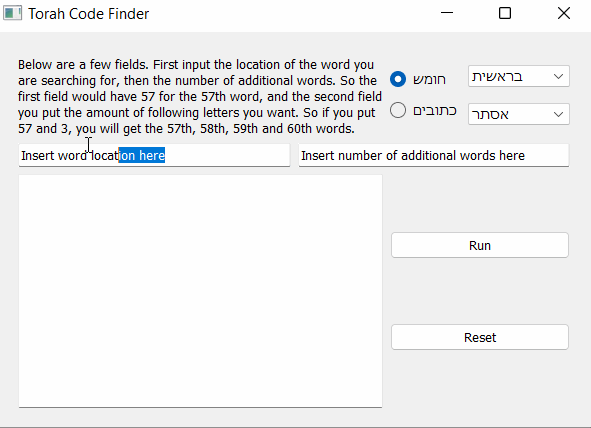

# Torah_Code_Finder
A program which accepts skips codes and applies them to some biblical texts

## Requirements
* PyQt5
* PySides6

## Letter Finder
This is the first function of the program. It takes a input of a letter sequence, a selection of a biblibcal text, and returns the specified characters. Meaning a
sequence of 101, 25, 9 would return letter 101, 126 (101 + 25), 135 (126 + 9), 236 (135 + 101) and so on. It loops through the text until it reaches the end where
it outputs all the selected characters

### Video Walkthrough

# Word Finder
This is the second fucntion of the program. It takes a input of a location, additional wanted words, and a specified text. It looks for that exact location in the
text, the returns the base word along with how ever many additonal words were requested. 

### Video Walkthrough

